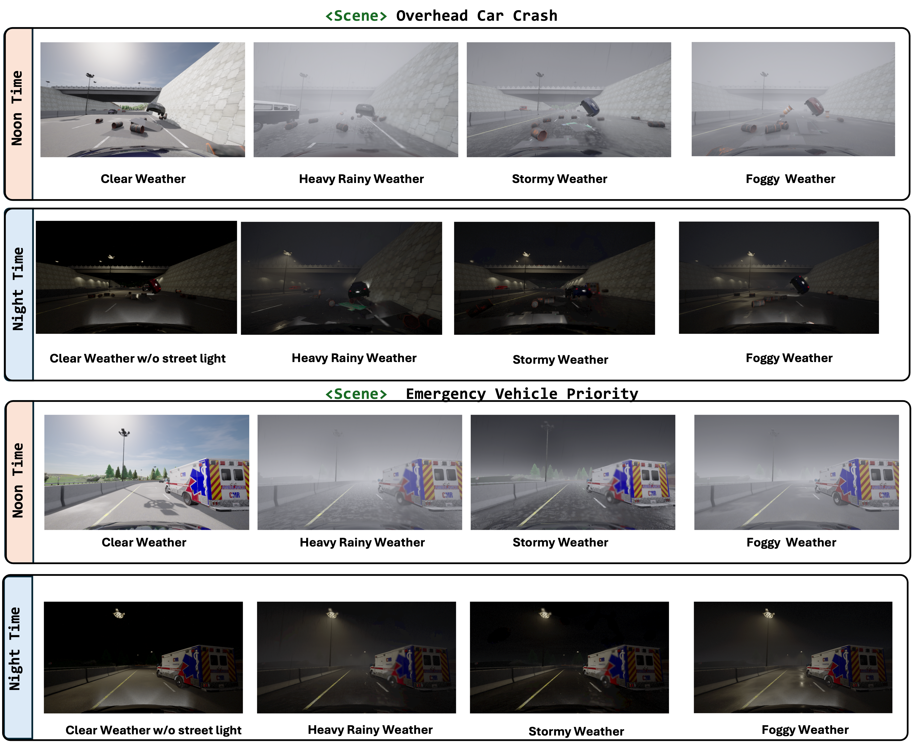
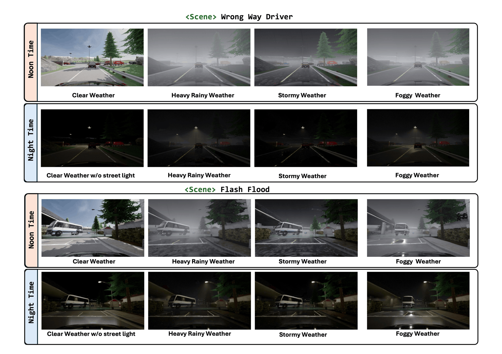

# Lang2Drive

**Agentic Prompt-to-Scene Generation and Vision-Language Reasoning for Safety-Critical Autonomous Driving**

Lang2Drive transforms natural-language corner-case descriptions into CARLA scenarios through a Text Scene Agent, Code Agent, and Evaluator Agent. A shared handoff manifest carries the scene specification, execution outputs, and feedback between refinement attempts.

## Scene generation

1. **Specify:** choose a scene and its constraints from the scenario workbook.
2. **Generate:** prepare the code-generation prompt and implement a standalone CARLA script, reusing a relevant seed when available.
3. **Execute:** check readiness, then run the script against CARLA.
4. **Evaluate and refine:** inspect the front-camera event and execution evidence; use structured feedback to revise unsuccessful attempts.
5. **Vary conditions:** capture the finalized scene under four weather conditions at Noon and Night.

The [scenario catalog](scene_catalog.json) follows Figure 1's 30 scenarios in five hazard families. The [generation guide](SCENE_GENERATION_REFERENCE.md) explains the agent workflow, manifests, refinement, and runtime requirements.

| Hazard family | Scenarios |
| --- | ---: |
| Road-User Interactions & Traffic-Rule Violations | 6 |
| Traffic-Control & Infrastructure Disruptions | 6 |
| Roadway Obstructions & Structural Debris | 6 |
| Dynamic Object Intrusions | 7 |
| Environmental & Road-Surface Hazards | 5 |

## Data Samples

Each scene is captured across **8 conditions** (4 weather × 2 time-of-day). The examples below show the ego-camera front view for selected scenarios.





### Setup

Use Python 3.10+ and a separately installed CARLA runtime with a matching CARLA Python API. Run the simulation commands in the Python environment that can connect to that runtime.

```bash
python -m pip install -r requirements-generation.txt
python agent_skill_scene_loop.py list-scenes
```

For macOS preparation with a CARLA Wine bundle, set `CARLA_APP_PATH` to the bundle's location. Execute simulation commands in Windows/Wine. Native Windows or Linux installations can run them directly with their matching CARLA Python environment.

### Prepare a scene

```bash
python agent_skill_scene_loop.py prepare --scene-serial 1
```

The command prints the new manifest, prompt, and code paths. Preparation copies an available seed or creates a placeholder; it does not by itself complete code generation. Use the full prompt and scene specification to implement the script, then run the explicit readiness, simulation, and review commands in the [generation guide](SCENE_GENERATION_REFERENCE.md).

### Eight weather-time conditions

| Public label | Stable configuration key |
| --- | --- |
| Clear | `clear` |
| Heavy Rainy | `storm` |
| Stormy | `worst` |
| Foggy | `foggy` |

Each weather is paired with `noon` and `night`. Existing directory keys are retained for compatibility; the numerical presets are defined in [the matrix specification](scene_utils/time_weather_matrix_spec.json).

After baseline review, run the resumable matrix using an explicit manifest:

```cmd
04_run_scene_matrix8.cmd "path\to\manifest.json"
```

Completed variants are revalidated before skipping. Failed or incomplete attempts are preserved before retry. The runner stops when cleanup is unverified. Capture integrity and visual acceptance are separate checks.

## Examples and human-verified frames

- [Generation artifacts](ARTIFACT_INDEX.md): retained prompt/code examples and their runtime requirements.
- [Human-verified keyframes](examples/verified_keyframes/README.md): a manifest of the human-reviewed collection and consolidated human-review sheets for three scenes.

## Verification

```bash
python -m unittest discover -s tests -q
```

The tests exercise generation helpers, readiness, scene-evaluation acceptance, and resumable capture using temporary fixtures. They do not start CARLA or invoke a model service.

---

## VLM Annotation Pipeline

After scenes are captured, the VLM annotation pipeline in `VLM_AV/` generates structured GPT annotations for every frame. The pipeline has three sequential stages:

```
Captured frames  ──►  [1] Keyframe Selection  ──►  [2] Regional Box Generation  ──►  [3] GPT Pre-annotation
                            keyframe_selection.py        region_box.py                  run_preannotation.py
```

### Stage 1 — Keyframe Selection (`keyframe_selection.py`)

Selects the most representative and diverse frames from each scenario using **CLIP + MMR (Maximal Marginal Relevance)**.

**How it works:**
- Encodes all frames with a `ViT-L-14` CLIP model.
- Scores each frame via cosine similarity against CLIP-friendly, scenario-specific text prompts (with prompt ensembling over 3 variants).
- Optionally adds a **novelty/motion term** (`novelty_weight`) to boost temporally distinct frames.
- Selects `top_k` keyframes using MMR to balance relevance and diversity.
- Outputs selected frames as `keyframe_NN_score_X.xxxxx.png` plus a `selected_keyframes.tsv` scoresheet per scenario.

**Key parameters (edit the `KeyframeConfig` block at the bottom of the script):**

| Parameter | Default | Description |
|---|---|---|
| `root_dir` | — | Root folder containing scenario subfolders |
| `out_dir` | — | Output folder for selected keyframes |
| `frames_subdir` | `"rgb"` | Sub-folder inside each scenario where frames live (`None` if frames are at the scenario root) |
| `top_k` | `10` | Number of keyframes to select per scenario |
| `mmr_lambda` | `0.72` | MMR balance: higher → more relevance, lower → more diversity |
| `novelty_weight` | `0.25` | Weight for motion/novelty term (`0.0` to disable) |
| `model_name` | `ViT-L-14` | CLIP backbone |

**Run:**
```bash
# Edit root_dir / out_dir inside the script, then:
python VLM_AV/keyframe_selection.py
```

> **Note:** For the evaluation set, keyframes are already pre-selected and organised into `<scenario>/<time__weather>/` subfolders. Skip this stage and go directly to Stage 2.

---

### Stage 2 — Regional Bounding Box Generation (`region_box.py`)

Detects objects in each keyframe using **YOLOv8** and refines detections into tight bounding boxes with **SAM (Segment Anything Model)**. Saves numbered overlay images and annotation JSON files.

**How it works:**
1. Runs YOLOv8 on each frame to get candidate boxes.
2. Filters out tiny boxes (< 48×48 px).
3. Refines each candidate with SAM to get a tight segmentation-derived bounding box.
4. Applies NMS and keeps the top-`k` boxes per frame.
5. Draws numbered red rectangles on the frame and saves the overlay image.
6. Saves a JSON annotation with `bbox_xyxy`, `score`, and `source` per detected object.

**Directory layout handled automatically:**
- Flat folder of images → processes as a single scenario.
- `root/<scenario>/<images>` → one level deep.
- `root/<scenario>/<time__weather>/<images>` → two levels deep (matches evaluation set structure).

**Outputs** (under `--out_dir`):

```
evaluation_final/
├── overlays/
│   └── <scenario>/<time__weather>/<frame>.png   # frame with numbered red boxes
└── annotations/
    └── <scenario>/<time__weather>/<frame>.json  # bbox_xyxy, score, source
```

**Run:**
```bash
cd VLM_AV
bash run_box.sh
```

`run_box.sh` contents:
```bash
python region_box.py \
  --root_dir /path/to/VLM_AV/evaluation_set \
  --out_dir  /path/to/VLM_AV/evaluation_final \
  --sam_type vit_b \
  --sam_ckpt /path/to/VLM_AV/sam_vit_b_01ec64.pth \
  --device cuda \
  --top_k 3
```

| Argument | Description |
|---|---|
| `--root_dir` | Input folder of keyframes |
| `--out_dir` | Output root (overlays + annotations saved here) |
| `--sam_type` | SAM model variant: `vit_b`, `vit_l`, `vit_h` |
| `--sam_ckpt` | Path to SAM checkpoint `.pth` file |
| `--top_k` | Max number of boxes to keep per frame |
| `--yolo_conf` | YOLO confidence threshold (default `0.25`) |

---

### Stage 3 — GPT Pre-annotation (`run_preannotation.py`)

Calls the OpenAI API (GPT) on every keyframe to generate structured JSON annotations for three perception tasks.

**Prompts** (defined in `prompts.json`):

| Key | Description |
|---|---|
| `general_perception` | Identify and describe all road users that influence ego-vehicle behaviour (vehicles, VRUs, signs, lights, barriers, etc.) |
| `regional_perception` | Describe each numbered object in the regional overlay image and its influence on driving |
| `actionable_suggestion` | Generate a structured driving action plan: immediate action, short-term plan, contingency, risk level, primary hazard |

**Output JSON per frame:**
```json
{
  "general_perception": { "vehicles": [...], "vulnerable_road_users": [...], ... },
  "regional_perception": { "1": { "description and explanation": "..." }, ... },
  "actionable_suggestion": {
    "immediate_action": "...",
    "short_term_plan": "...",
    "contingency_plan": "...",
    "primary_hazard": "...",
    "risk_level": "low/medium/high",
    "risk_explanation": "..."
  }
}
```

**Prerequisites:**
```bash
export OPENAI_API_KEY="sk-..."
```

**Run:**
```bash
cd VLM_AV
bash run_gpt.sh
```

`run_gpt.sh` contents:
```bash
python run_preannotation.py \
  --input_dir          /path/to/VLM_AV/evaluation_set \
  --input_dir_regional /path/to/VLM_AV/evaluation_final/overlays \
  --output_dir         /path/to/VLM_AV/evaluation_final/GPT_response \
  --prompts            /path/to/VLM_AV/prompts.json \
  --model              gpt-4o
```

| Argument | Description |
|---|---|
| `--input_dir` | Root folder of plain keyframe images (for general + actionable prompts) |
| `--input_dir_regional` | Root folder of regional overlay images from Stage 2 |
| `--output_dir` | Where GPT response JSONs are saved (mirrors input directory structure) |
| `--prompts` | Path to `prompts.json` |
| `--model` | OpenAI model name |
| `--overwrite` | Re-process frames that already have a saved JSON |

Existing outputs are skipped automatically unless `--overwrite` is passed. If no regional overlay is found for a frame, `regional_perception` is set to `null` in the output.
