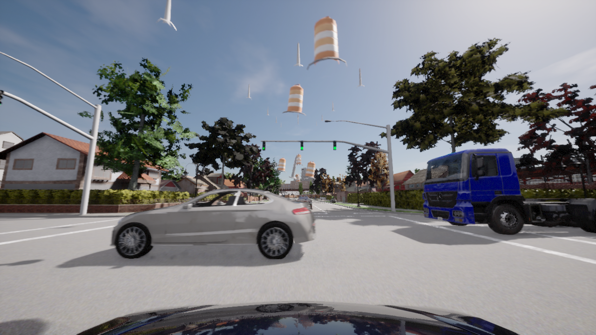
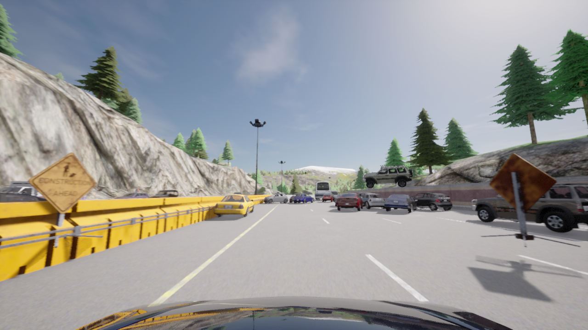
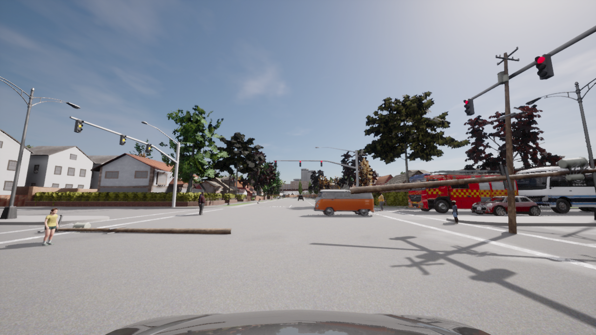
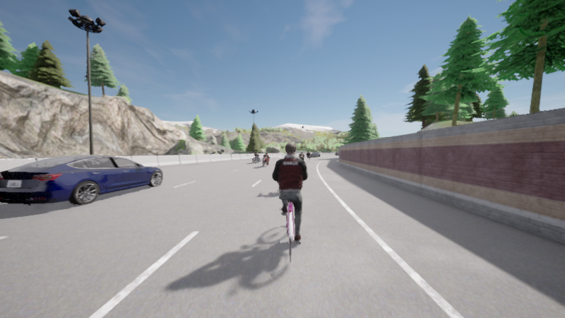
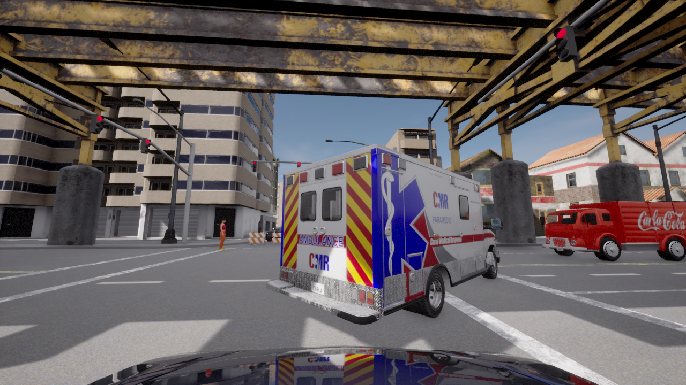

# Human-verified evaluation keyframes

This collection indexes **1,200 human-verified frames** from **30 source scenarios**, across **eight weather-time conditions**, with **five temporally ordered frames per scenario-condition pair**. The images were selected and checked by human reviewers. The selection does not use the automated CLIP top-30 procedure.

[JSON manifest](manifest.json) · [CSV manifest](manifest.csv)

The manifest covers the verified collection. Five original PNGs are included below; the full image set is not stored in this repository.

## Manifest fields

| Field | Meaning |
| --- | --- |
| `scenario_id` | Stable source scenario identifier |
| `paper_display_name` | Figure 1 name, or null when the source scenario is outside that roster |
| `hazard_family` | `road_user`, `traffic_control`, `obstruction`, `dynamic_object`, or `environmental` |
| `weather`, `time_of_day` | Paper weather labels and Noon/Night |
| `frame_id`, `temporal_order` | Original frame identifier and position within the five-frame selection |
| `dataset_path` | Relative path within the external dataset |
| `sha256` | SHA-256 of the original PNG bytes |
| `width`, `height` | Image dimensions in pixels |
| `visual_verification_status` | `human_verified`: the selected frame was checked by a human reviewer |

Source folder aliases `storm` and `worst` correspond to Heavy Rainy and Stormy, respectively. Paths preserve these aliases. Human verification records a visual review; it does not certify dynamics, collision-free execution, annotation quality, or a particular model's performance.

## Coverage

The collection covers 29 of Figure 1's 30 scenarios and also includes `wrongway_driver`, whose `paper_display_name` is null. No verified frames for `zero_gravity_street` (Overhead car crash) are included. The source IDs `floating_rocks_on_the_road` and `zero_gravity_street` map to Landslide rocks on the road and Overhead car crash in the paper. Counts describe this collection, rather than establishing identity with any experimental split.

## Representative preview

For each hazard family, the preview uses the first available paper scenario by stable scenario ID under Noon-Clear, then the middle frame in temporal order. These are original, unmodified images with checksums recorded in the manifest.

### Flying traffic cones

### Bridge icing patch

### Fallen power lines

### Bicycle in highway lane

### Ambulance stuck at crossing

